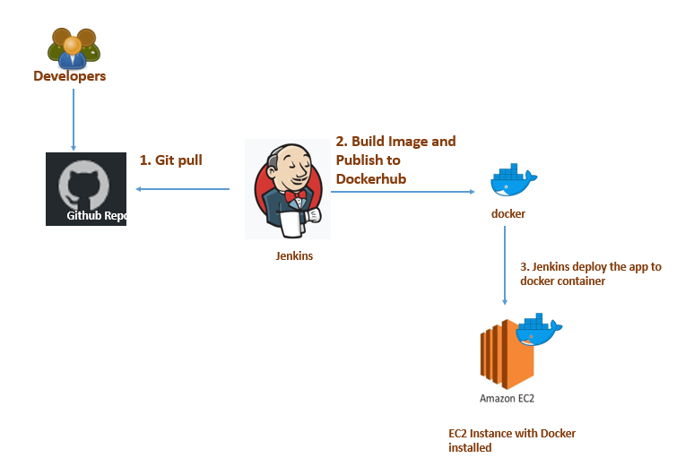

# Build, Publish, Deploy Docker Image on ECS cluster

This is a sample Flask application written in Python. The goal here is to create CI/CD pipeline which includes the following steps:
  1. **Build Docker Image from source code**
  2. **Publish Docker Image to DockerHub**
  3. **Clean Up articats**
  4. **Deploy container on AWS ECS**

## Architecture



## Deployment
I have deploy a container on AWS ECS using 2 different methods.
  ### 1. **Jenkins**
  If you are using a Jenkins server for CI/CD, you can trigger a Jenkins job via Webhook. The Jenkinsfile is added to the source code that you can specify in your project configuration. Make sure you have global credential configured for DockerHub or whatever private/public repository you use.
  ```bash
  pipeline { 
    environment { 
        registry = "jpolara2016/test_app" 
        registryCredential = 'dockerhub_id' 
        dockerImage = '' 
    }
    agent any 
    stages {
        stage('Cloning Git') { 
            steps { 
                git 'https://github.com/jpolara2016/test_app' 
            }
        } 
        stage('Building image') { 
            steps { 
                script { 
                    dockerImage = docker.build registry + ":latest" 
                }
            } 
        }
        stage('Deploy image') { 
            steps { 
                script { 
                    docker.withRegistry( '', registryCredential ) { 
                        dockerImage.push() 
                    }
                } 
            }
        } 
        stage('Cleaning up') { 
            steps { 
                sh "docker rmi $registry:latest" 
            }
        }
        stage('Updating Cluster Definition') { 
            steps { 
                sh '''
                app_name="test-app"
                region="us-east-1"
                cluster_name=`aws ecs list-clusters | grep $app_name | awk -F "/" '{ print $2 }' | sed 's/"//'`
                ecs_service_name=`aws ecs list-services --cluster $cluster_name | awk -F "/" '{ print $3 }' | sed 's/"//' | sed '/^$/d'`
                task_definition_name=`aws ecs list-task-definitions | grep $app_name | awk -F: '{ print $6 }' | awk -F "/" '{ print $2 }'`
                desired_count=`aws ecs describe-services --cluster $cluster_name --services $ecs_service_name | grep desiredCount | tail -n 1 | awk -F ": " '{ print $2 }' | sed 's/,//'`
                aws ecs --region $region update-service --cluster $cluster_name --service $ecs_service_name --task-definition $task_definition_name --desired-count $desired_count --force-new-deployment
                '''
            }
        }
    }
}
  ```
 ### 2. **GitGub Actions**
  GitHub Actions is also gonna do the same work the above Jenkins job does. I personally prefer this method if you dont want burden of managing Jenkins or dont manage Jenkins. There are lots of inegration available for GitHub actions. It uses secrests for authentication/integration that is defined under settings/secrets of test_app repository. 
  ```yml
  name: Sample Python Flask Application

# Controls when the action will run. 
on:
  # Triggers the workflow on push or pull request events but only for the master branch
  push:
    branches: [ master ]
  pull_request:
    branches: [ master ]

  # Allows you to run this workflow manually from the Actions tab
  workflow_dispatch:

# A workflow run is made up of one or more jobs that can run sequentially or in parallel
jobs:
  # This workflow contains a single job called "build"
  build_docker_image:
    # The type of runner that the job will run on
    runs-on: ubuntu-latest

    # Steps represent a sequence of tasks that will be executed as part of the job
    steps:
      - uses: actions/checkout@v2

      - name: Set up Python 3.8
        uses: actions/setup-python@v1
        with:
          python-version: 3.8
          
      - name: Install requirements
        run: |
          python3 -m pip install --upgrade pip
          pip3 install -r requirements.txt
          
      - name: echo workspace
        run: echo $GITHUB_WORKSPACE
        shell: bash
        
      - name: Set up QEMU
        uses: docker/setup-qemu-action@v1
      
      - name: Set up Docker Buildx
        uses: docker/setup-buildx-action@v1
      
      - name: Login to DockerHub
        uses: docker/login-action@v1
        with:
          username: ${{ secrets.DOCKER_USERNAME }}
          password: ${{ secrets.DOCKER_PASSWORD }}
      
      - name: Build and push
        uses: docker/build-push-action@v2
        with:
          context: .
          push: true
          tags: jpolara2016/test_app:latest
          
# Deploy container on ECS          
  deploy_on_ecs:
    needs: build_docker_image
    runs-on: ubuntu-latest
    
    steps:

      - name: Configure AWS credentials
        uses: aws-actions/configure-aws-credentials@v1
        with:
          aws-access-key-id: ${{ secrets.AWS_ACCESS_KEY_ID }}
          aws-secret-access-key: ${{ secrets.AWS_SECRET_ACCESS_KEY }}
          aws-region: us-east-1

      - name: Get Task Definition details
        run: |
          app_name="test_app"
          cluster_name=`aws ecs list-clusters | grep $app_name | gawk -F "/" '{ print $2 }' | sed 's/"//'`
          ecs_service_name=`aws ecs list-services --cluster $cluster_name | gawk -F "/" '{ print $3 }' | sed 's/"//' | sed '/^$/d'`
          task_definition_name=`aws ecs list-task-definitions | grep test_app | gawk -F: '{ print $6 }' | gawk -F "/" '{ print $2 }'`
          desired_count=`aws ecs describe-services --cluster $cluster_name --services $ecs_service_name | grep desiredCount | tail -n 1 | gawk -F ": " '{ print $2 }' | sed 's/,//'`
          aws ecs --region us-east-1 update-service --cluster $cluster_name --service $ecs_service_name --task-definition $task_definition_name --desired-count $desired_count --force-new-deployment
  ```
